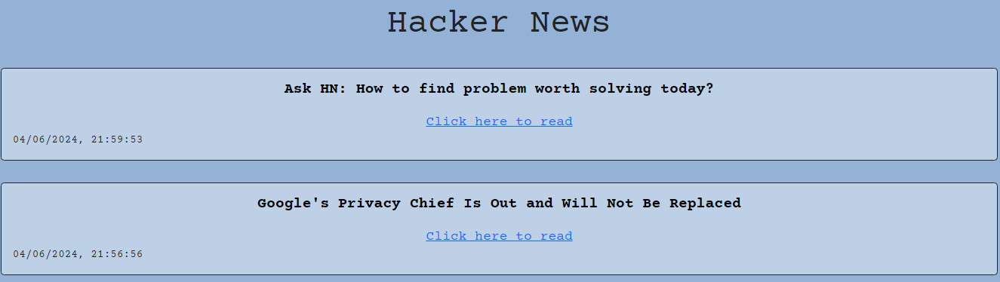

# Hacker-News

## Descrizione

Progetto finale per il corso Start2Impact "Javascript Advanced"

sviluppare un’applicazione per democratizzare la diffusione di informazioni in ambito tech attraverso l'utilizzo del servizio Hacker News.

## Richieste tecniche
L’applicazione allo startup dovrà visualizzare l’elenco delle ultime news disponibili visualizzando il titolo, il link e la data della news.
Dovrà quindi contattare le API (come da documentazione) del servizio esterno Hacker News per recuperare la lista degli ID delle ultime news.
Per ogni ID l’applicazione dovrà contattare un’altra API del servizio Hacker News per ottenere le informazioni da visualizzare quali titolo, link e data della news.
Richiesto utilizzo del bundler per moduli WebPack e l'utilizzo della libreria JS Axios.

## Installazione

Clona il repository: `git clone https://github.com/Danixpad22/JSAdvanced.git`

## Utilizzo

L'utente, appena entrato nella pagina, visualizzerà le news richiamate dalle API.

## Linguaggi utilizzati

HTML
CSS
JavaScript

## Screenshot 

# Link al sito
<a href="https://danixpad22.github.io/JSAdvanced/">Hacker News<a>
